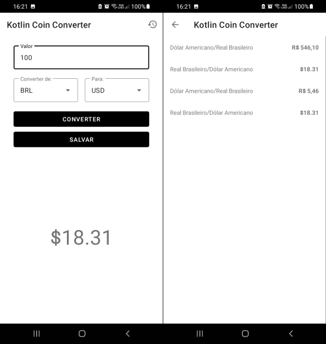

# Kotlin Coin Converter

- Instrutor: [Ezequiel Messore](https://www.linkedin.com/in/ezequielmessore/)
- Repositório original: [coin-converter](https://github.com/EzequielMessore/coin-converter/)
- Plataforma de Ensino: [Digital Innovation One](https://digitalinnovation.one/sign-up?ref=K5EF2VCVKA)
- Módulo Criando um aplicativo para conversão de moedas e câmbio - Dio Bootcamp Carrefour Dev Android

## Vídeo Explicativo

  [Youtube](https://youtu.be/BKUclZ9Iuo8)

##  Objetivo

- Aplicação destinada à prática do módulo "Criando um aplicativo para conversão de moedas e câmbio".

- Criação de um App do zero em Kotlin, adotando o padrão de projetos MVVM, consultando uma API para realizar a conversão de moedas.

- Implementação de funcionalidades não tratadas no módulo.
	- [ok] botão voltar na toolbar (main e histórico)
	- [&ensp;&ensp;] ao girar celular não persiste os dados da tela
	- [&ensp;&ensp;] botão "alternar" moedas  (Material Icons swap_horiz)
	- [&ensp;&ensp;] exibir tela amigavél quando o histórico de conversões estiver vazio

## Tecnologias Utilizadas

- [Kotlin](https://kotlinlang.org/docs/getting-started.html)
- [Material Design](https://material.io/design)
- [GitFlow](https://medium.com/trainingcenter/utilizando-o-fluxo-git-flow-e63d5e0d5e04)
- [MVVM](https://medium.com/android-dev-br/arquiteturas-em-android-mvvm-kotlin-android-architecture-components-databinding-lifecycle-d5e7a9023cf3)
- [Koin](https://insert-koin.io/)
- [Retrofit](https://square.github.io/retrofit/)
- [Room](https://developer.android.com/training/data-storage/room#kts)
- [Coroutines](https://kotlinlang.org/docs/coroutines-overview.html)
- [Lifecycle](https://developer.android.com/jetpack/androidx/releases/lifecycle)
- [Android Studio](https://developer.android.com/studio/intro)
- [Quick Type](https://app.quicktype.io/)
- [JSON Editor Online](https://jsoneditoronline.org/)

## Conteúdo Apresentado

- Etapa 1: Conhecendo nosso Projeto Base (MVVM)

- Etapa 2: Processamento Assíncrono: Coroutines e Flow

- Etapa 3: Integração com uma API REST: [AwesomeAPI](https://docs.awesomeapi.com.br/api-de-moedas/)

## Desafio Proposto (TODO)

- [&ensp;&ensp;] remover da lista "to" o item selecionado em "from"
- [&ensp;&ensp;] salvar mais informações no histórico
- [&ensp;&ensp;] melhorar layout da listagem do histórico das conversões

## Pesquisa Complementar

- [Documentação da API](https://docs.awesomeapi.com.br/api-de-moedas)
- [Arquiteturas em Android - MVVM](https://medium.com/android-dev-br/arquiteturas-em-android-mvvm-kotlin-android-architecture-components-databinding-lifecycle-d5e7a9023cf3)
- [View Model](https://developer.android.com/topic/libraries/architecture/viewmodel?hl=pt-br/) 
- [Artigo Koin](https://medium.com/collabcode/inje%C3%A7%C3%A3o-de-depend%C3%AAncia-no-kotlin-com-koin-4d093f80cb63/)
- [Utilizando Kotlin Coroutines no Android](https://medium.com/android-dev-br/utilizando-kotlin-coroutines-no-android-c73fcda71e27)
- [Como lidar com erros com Retrofit e Coroutines](https://medium.com/android-dev-br/como-lidar-com-erros-com-retrofit-e-coroutines-7b5af3ce3ef/)
- [Artigo Room](https://medium.com/collabcode/android-archtecture-components-com-kotlin-persistindo-dados-com-room-f8c9eba58854)

## Autor

Bruno Gamba Rocha

[Linkedin](https://www.linkedin.com/in/bruno-gamba-rocha/)

